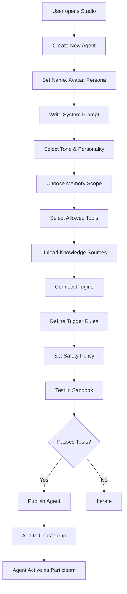
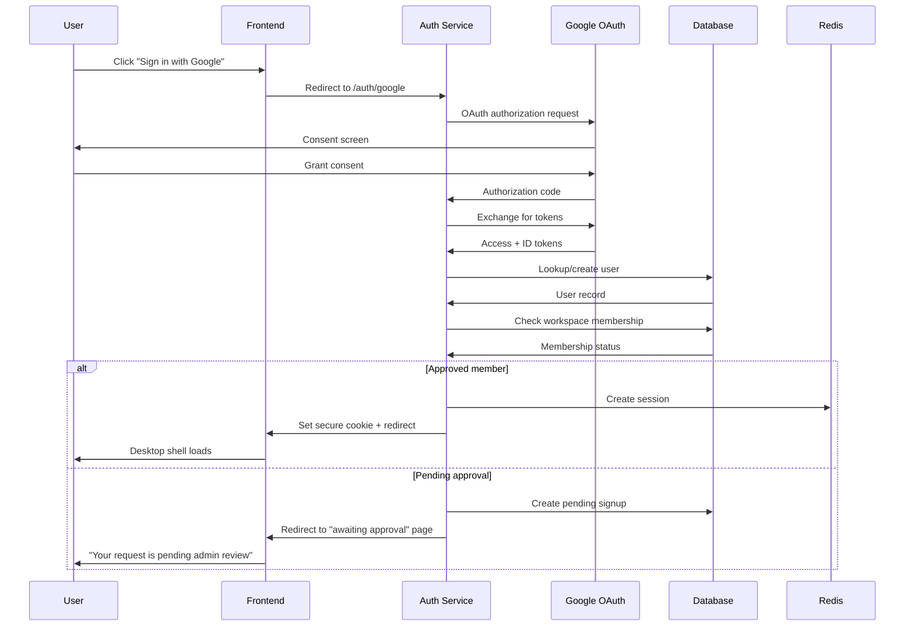
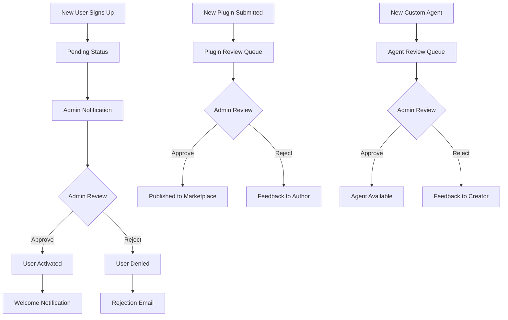

# UNHINGED — Full Product Implementation Plan

> A futuristic Windows-like web operating system for teams, powered by an Obsidian-backed AI brain, sarcastic proactive agents, a plugin/agent studio, and a full collaboration platform.

---

## 1. My Understanding of the Product

UNHINGED is a **complete platform** — not an MVP — that merges five paradigms into one:

| Paradigm | What it means in UNHINGED |
|---|---|
| **Web Operating System** | A persistent desktop shell with draggable/resizable app windows, taskbar, desktop icons, wallpapers, command palette, notification center, and offline cache |
| **Real-time Collaboration** | DMs, group chats, reactions, read receipts, voice notes, file sharing, message search, and presence — all over WebSockets |
| **AI Agent Runtime** | Orbit (team assistant) and Icebound (chaotic problem-solver) as system agents, plus user-built custom agents that join chats as first-class participants |
| **Knowledge OS / Second Brain** | Obsidian vault as the canonical, durable knowledge store — agents read from and write to markdown files, making the entire platform's memory human-readable, portable, and version-controllable |
| **Extension Platform** | A Studio app for building custom agents and plugins, a marketplace for sharing them, and a tool registry that agents can use with permissioned access |

### The Core Architectural Insight

> **Obsidian is the brain. LangGraph/LangChain is the reasoning layer on top of it.**

The app database holds operational state (permissions, chat metadata, presence, notifications). But **durable knowledge** — memories, decisions, tasks, summaries, meeting notes — lives as structured markdown in the Obsidian vault. Agents don't query a giant chat history blob; they query a curated, indexed, folder-organized vault through RAG and direct file tools.

This is the "second brain" pattern at platform scale.

---

## 2. My Suggestions & Architectural Recommendations

### 2.1 Tech Stack Recommendation

I've analyzed the PDF's proposed stack and here's my refined recommendation with rationale:

#### Frontend

| Technology | Role | Why |
|---|---|---|
| **Next.js 14+ (App Router)** | Framework | Server components for SEO, API routes, middleware for auth, excellent DX |
| **TypeScript** | Language | Non-negotiable for a project this size — type safety across 20+ data models |
| **Tailwind CSS** | Styling | Rapid iteration on complex desktop-like UI with dark mode, glassmorphism, animations |
| **Zustand** | Global state | Lightweight, no boilerplate — perfect for window manager state, presence, notifications |
| **React DnD / @dnd-kit** | Window management | Drag, resize, snap, minimize, maximize — the shell's core interaction model |
| **Socket.IO Client** | Real-time | Presence, typing indicators, message delivery, agent responses |
| **Framer Motion** | Animations | Micro-interactions, window transitions, notification toasts, agent typing bubbles |
| **CodeMirror 6** | Editor | For the Studio app's prompt editor, plugin code editor, and note editing |
| **TanStack Query** | Data fetching | Caching, background refetching, optimistic updates for chat and vault data |

#### Backend

| Technology | Role | Why |
|---|---|---|
| **Node.js + Express/Fastify** | API Gateway | Fast, event-driven, excellent WebSocket integration |
| **Socket.IO** | Real-time Gateway | Rooms, namespaces, Redis adapter for multi-instance fanout |
| **LangGraph** | Agent Orchestrator | Stateful graph-based agent workflows with checkpointing — perfect for multi-step agent runs |
| **LangChain** | Agent Tools & Chains | Tool abstraction, RAG chains, memory management, prompt templates |
| **LangSmith** | Observability | Trace every agent run, debug prompts, monitor latency and token usage |
| **BullMQ** | Job Queues | Summarization, embedding generation, vault sync, file processing, moderation |
| **Passport.js + Google OAuth** | Auth | Google SSO with session management |

#### Data & Infrastructure

| Technology | Role | Why |
|---|---|---|
| **PostgreSQL** | Primary DB | Relational integrity for users, workspaces, messages, permissions — 20+ tables need joins |
| **Prisma** | ORM | Type-safe queries, migrations, schema management — critical for this schema size |
| **Redis** | Cache + Pub/Sub + Queues | Session cache, presence, typing state, short-term agent memory, Socket.IO adapter, BullMQ backend |
| **Obsidian Vault (local markdown)** | Knowledge Store | The canonical brain — structured markdown files with frontmatter |
| **Git** | Vault versioning | Every vault write is a commit — full history, rollback, blame, diff |
| **Pinecone / Weaviate / Chroma** | Vector DB | Embeddings over vault content for semantic RAG retrieval |
| **MinIO / S3** | Object Storage | File uploads, voice notes, avatars, plugin assets |
| **Meilisearch / Typesense** | Search Index | Full-text search across chats, notes, files, hackathons — fast and typo-tolerant |

#### AI Models

| Model | Role | Why |
|---|---|---|
| **GPT-4o / Claude** | Primary LLM | Orbit and Icebound responses, summarization, reasoning |
| **GPT-4o-mini / Gemini Flash** | Fast tasks | Quick replies, classification, tag extraction, moderation |
| **text-embedding-3-small** | Embeddings | Vault indexing, semantic search, RAG retrieval |
| **Whisper** | Voice-to-text | Voice note transcription |

---

### 2.2 Obsidian Brain — Deep Architecture

> [!IMPORTANT]
> This is the most critical architectural decision. Obsidian is not a feature — it's the foundation. Every other system reads from or writes to it.

#### The Five-Layer Model

```
┌─────────────────────────────────────────────────┐
│                  PRESENTATION                    │
│        Web OS Shell, App Windows, Chat UI        │
├─────────────────────────────────────────────────┤
│                 OPERATIONAL DB                   │
│   Postgres: users, permissions, chat metadata,   │
│   presence, notifications, audit logs            │
├─────────────────────────────────────────────────┤
│              OBSIDIAN VAULT (BRAIN)              │
│   Canonical knowledge: memories, decisions,      │
│   tasks, summaries, notes, agent logs            │
├─────────────────────────────────────────────────┤
│                  AGENT LAYER                     │
│   LangGraph orchestrator, LangChain tools,       │
│   reads/writes vault through controlled tools    │
├─────────────────────────────────────────────────┤
│                  INDEX LAYER                     │
│   Vector embeddings + full-text search index     │
│   for fast retrieval over vault content           │
├─────────────────────────────────────────────────┤
│                  CACHE LAYER                     │
│   Redis: sessions, presence, short-term memory,  │
│   queues, pub/sub for real-time events           │
└─────────────────────────────────────────────────┘
```

#### Vault Folder Structure

```
vault/
├── inbox/                    # Raw incoming data (unreviewed)
│   ├── chat-exports/
│   ├── file-uploads/
│   └── agent-drafts/
├── chats/                    # Approved chat summaries
│   ├── group-alpha/
│   │   ├── 2026-08-04.md
│   │   └── 2026-08-03.md
│   └── dm-threads/
├── groups/                   # Group metadata and context
│   ├── group-alpha.md
│   └── group-beta.md
├── users/                    # Per-user profiles and preferences
│   ├── aryan.md
│   └── team-preferences.md
├── memories/                 # Curated knowledge and context
│   ├── team-preferences.md
│   ├── project-context.md
│   └── recurring-topics.md
├── decisions/                # Approved decisions and outcomes
│   ├── product-roadmap.md
│   └── tech-stack-choice.md
├── tasks/                    # Action items and follow-ups
│   ├── sprint-2026-08.md
│   └── backlog.md
├── files/                    # File metadata and references
│   └── uploads-index.md
├── hackathons/               # Ingested hackathon data
│   ├── active/
│   └── archive/
├── agent-logs/               # Agent action audit trail
│   ├── orbit/
│   └── icebound/
├── templates/                # Note templates for consistency
│   ├── chat-summary.md
│   ├── decision-record.md
│   ├── task-item.md
│   ├── memory-note.md
│   └── weekly-digest.md
└── summaries/                # Periodic rollups
    ├── daily/
    ├── weekly/
    └── monthly/
```

#### Note Template Example — Memory Note

```markdown
---
workspace: ws_alpha
author: orbit-agent
group: group-alpha
tags: [preference, tooling, team]
sensitivity: low
retention: permanent
created: 2026-08-04T10:30:00Z
source: chat-summary
---

# Team Prefers TypeScript Over JavaScript

The team discussed language preferences on 2026-08-03. Consensus was:
- TypeScript for all new code
- Strict mode enabled
- No `any` types without explicit approval

## Context
This came up during sprint planning when reviewing the new plugin SDK.

## Related
- [[decisions/tech-stack-choice]]
- [[tasks/sprint-2026-08]]
```

#### Data Flow — The Brain Pipeline

```mermaid
flowchart TD
    A[User Action] --> B[UI Event]
    B --> C[API / WebSocket Gateway]
    C --> D[Operational DB Write]
    D --> E{Policy Engine}
    E -->|Approved| F[Sync Worker]
    E -->|Rejected| G[Stays in DB only]
    F --> H[Convert to Markdown]
    H --> I[Write to inbox/]
    I --> J{Review / Auto-Promote}
    J |Auto-promote| K[Move to memories/ or decisions/]
    J |Needs review| L[Stay in inbox/]
    K --> M[Embedding Generator]
    M --> N[Vector DB Index]
    K --> O[Full-Text Index]
    P[Agent Request] --> Q[RAG Retrieval]
    Q --> N
    Q --> O
    Q --> R[Direct Vault File Read]
    R --> S[Agent Reasoning - LangGraph]
    S --> T[Agent Response]
    S --> U[Agent Vault Write]
    U --> V[agent-logs/ or summaries/]
    V --> M
```

#### Safety Rules for the Vault

> [!CAUTION]
> Agents must NEVER have unrestricted write access to the entire vault. This is the single most important safety constraint.

| Rule | Implementation |
|---|---|
| **Inbox-first writes** | All raw incoming data goes to `inbox/` — never directly to `memories/` or `decisions/` |
| **Promotion gate** | A policy engine or admin review promotes content from `inbox/` to permanent folders |
| **Folder-scoped access** | Each agent declares which folders it can read/write — enforced at the tool level |
| **Sensitive content exclusion** | Notes tagged `sensitivity: high` are excluded from agent context unless explicitly decrypted |
| **Audit every write** | Every vault modification is logged with actor, timestamp, diff, and reason |
| **Git versioning** | Every vault write is a Git commit — full history and rollback, blame, diff |
| **No cross-workspace reads** | Workspace A's vault is completely invisible to Workspace B's agents |

---

### 2.3 Agent Architecture — Deep Design

#### Agent Orchestrator Pipeline (LangGraph)

```mermaid
flowchart LR
    A[Event Listener] --> B[Scope Checker]
    B --> C[Policy Guard]
```markdown
[3. Policy Guard]
    C --> D[4. Trigger Evaluator]
    D --> E[5. Persona Router]
    E --> F[6. Memory Retriever]
    F --> G[7. Tool Planner]
    G --> H[8. Tool Executor]
    H --> I[9. Reply Composer]
    I --> J[10. Vault Writer]
    J --> K[11. Audit Logger]
    K --> L[12. Feedback Collector]
```

Each step is a **LangGraph node** with checkpointing, so agent runs can be:
- Paused and resumed
- Inspected mid-run
- Rolled back on failure
- Traced in LangSmith

#### Agent Comparison

| Property | Orbit | Icebound | Custom Agent |
|---|---|---|---|
| **Purpose** | Team assistant, coordination, summaries | Venting, problem-solving, chaos | User-defined specialist |
| **Tone** | Sarcastic, funny, dry | Sharper, chaotic, playful | User-configured |
| **Access** | Allowed groups only | Allowed groups or dedicated rooms | Defined by creator |
| **Reply behavior** | Proactive or silent | Respond to prompts or auto-reply | Configurable triggers |
| **Vault read scope** | `chats/`, `memories/`, `decisions/`, `tasks/` | `chats/`, `memories/` | Creator-defined folders |
| **Vault write scope** | `summaries/`, `tasks/`, `agent-logs/orbit/` | `agent-logs/icebound/` | Creator-defined + `inbox/` |
| **Tools** | Summarize, create task, search vault, search web | Roast, brainstorm, debug, vent | User-selected from registry |
| **Memory** | Long-term via vault, short-term via Redis | Session-scoped, minimal persistence | Configurable |

#### Agent Tool Registry

Agents access the world through **controlled tools**. Every tool is:
- Declared in a manifest
- Permission-checked per agent
- Rate-limited
- Audit-logged

| Tool | Description | Risk Level |
|---|---|---|
| `vault_read` | Read a markdown file from allowed vault folders | Low |
| `vault_write` | Write/update a markdown file in allowed vault folders | Medium |
| `vault_search` | Semantic search over vault embeddings | Low |
| `chat_read` | Read recent messages from an allowed group | Low |
| `chat_reply` | Send a message to a group as the agent | Medium |
| `web_search` | Search the internet | Low |
| `file_read` | Read an uploaded file's content | Low |
| `task_create` | Create a task in the tasks vault folder | Medium |
| `summary_create` | Create a summary note | Medium |
| `hackathon_search` | Search hackathon listings | Low |
| `plugin_invoke` | Call an installed plugin's API | High |
| `user_lookup` | Look up a user's profile | Low |
| `notification_send` | Send a notification to a user | Medium |

#### How Custom Agents Work in Studio



Custom agent entity model:

```
CustomAgent {
  id: uuid
  name: string
  avatar_url: string
  system_prompt: text
  persona: string
  tone: enum [professional, casual, sarcastic, chaotic, custom]
  memory_scope: json  // which vault folders
  tool_permissions: json  // which tools + scopes
  model_provider: enum [gpt-4o, claude, gemini, custom]
  knowledge_sources: json  // uploaded files, vault folders
  trigger_rules: json  // when to auto-respond
  safety_policy: json  // content filters, rate limits
  allowed_chat_scopes: json  // which groups/DMs
  owner_user_id: uuid
  workspace_id: uuid
  status: enum [draft, testing, published, suspended]
  version: integer
  created_at: timestamp
}
```

---

### 2.4 Plugin Marketplace — Deep Design

#### Plugin Types

| Type | Description | Example |
|---|---|---|
| **UI Plugin** | Adds windows, widgets, or panels to the shell | Kanban board, calendar, whiteboard |
| **Tool Plugin** | Exposes a new tool that agents can use | Google Sheets connector, Jira integration |
| **Workflow Plugin** | Automates multi-step processes | Auto-standup, deploy pipeline |
| **Agent Skill Plugin** | Adds capabilities to agents | Code review skill, design critique skill |
| **Data Connector** | Bridges external data sources | GitHub, Notion, Slack import |

#### Plugin Manifest

```json
{
  "name": "kanban-board",
  "version": "1.2.0",
  "author": "aryan",
  "description": "A draggable Kanban board with vault-backed persistence",
  "type": "ui",
  "permissions": [
    "vault_read:tasks/",
    "vault_write:tasks/",
    "ui_window:create"
  ],
  "surfaces": ["window", "widget"],
  "entry": "index.js",
  "sandbox": true,
  "dependencies": [],
  "min_platform_version": "1.0.0"
}
```

#### Plugin Safety

| Control | Implementation |
|---|---|
| **Sandboxed execution** | Plugins run in iframes or Web Workers with restricted APIs |
| **Permission declaration** | Every plugin declares exactly what it needs — no implicit access |
| **Admin approval gate** | Public plugins require admin approval before workspace install |
| **Scope isolation** | A plugin in Workspace A cannot access Workspace B data |
| **Rate limitation** | Plugin API calls are rate-limited per workspace |
| **Audit trail** | Every plugin install, uninstall, and API call is logged |
| **Revocation** | Admin can instantly disable any plugin across the workspace |

---

### 2.5 Security Architecture

#### Authentication Flow



#### Authorization Model — RBAC

| Role | Permissions |
|---|---|
| **Admin/Owner** | Full control: approve users, manage roles, revoke access, install plugins, set policies, view audit logs |
| **Moderator** | Manage groups, moderate messages, pin content, mute users, approve group agents |
| **Member** | Chat, create notes, use agents, install personal plugins, create custom agents |
| **Guest** | Read-only access to specific groups, no agent creation, no plugin installs |
| **Agent** | Scoped read/write to allowed groups and vault folders, tool execution within permissions |
| **Plugin** | Scoped API access per manifest, no direct DB access, sandboxed execution |

#### Data Isolation

```
Workspace A                    Workspace B
┌──────────────┐              ┌──────────────┐
│ Messages     │              │ Messages     │
│ Files        │   ISOLATED   │ Files        │
│ Vault        │◄────────────►│ Vault        │
│ Agents       │   NO CROSS   │ Agents       │
│ Plugins      │   ACCESS     │ Plugins      │
│ Memories     │              │ Memories     │
└──────────────┘              └──────────────┘
```

#### Encryption

| Layer | Method |
|---|---|
| **Transport** | TLS 1.3 mandatory on all connections |
| **At rest** | AES-256 for DB, object storage, and vault backups |
| **E2EE (optional)** | Per-chat or per-workspace E2EE — when enabled, agents cannot read content unless an explicit decrypted assistant flow exists |
| **Vault encryption** | Sensitive notes can be individually encrypted with workspace keys |

#### Safety Measures

| Threat | Mitigation |
|---|---|
| Prompt injection | Input sanitization, system prompt isolation, output validation |
| Tool abuse | Per-tool rate limiting, allowlists, permission checks |
| Malicious files | File scanning, type validation, size limits, sandboxed preview |
| Plugin exploits | Iframe sandboxing, CSP headers, no direct DOM access |
| Data exfiltration | Network egress controls on plugins, no external calls without permission |
| Memory poisoning | Inbox-first pattern, review gate, admin override |

---

### 2.6 Admin Console

#### Admin Functions

| Function | Description |
|---|---|
| **User Management** | Review pending signups, approve/reject, revoke access, manage roles |
| **Workspace Policy** | Set retention policies, E2EE zones, allowed models, content policies |
| **Plugin Governance** | Approve/reject plugins, view permissions, force-uninstall, block publishers |
| **Agent Governance** | Approve/reject custom agents, suspend abusive agents, view agent runs |
| **Audit Trail** | Search and filter all actions: logins, messages, vault writes, plugin installs, agent runs |
| **Analytics** | Active users, message volume, agent usage, plugin popularity, vault growth |
| **Memory Retention** | Define what's kept forever, summarized, archived, or deleted |
| **Group Management** | Suspend groups, remove members, disable agent access |
| **Compliance** | Export user data, delete user data, GDPR/privacy compliance tools |

#### Admin Approval Flow



---

### 2.7 Full Database Schema

> [!NOTE]
> PostgreSQL is the operational database. Obsidian vault is the knowledge database. They serve different purposes and sync through workers.

#### Users & Auth

```sql
-- Core user identity
CREATE TABLE users (
    id UUID PRIMARY KEY DEFAULT gen_random_uuid(),
    email VARCHAR(255) UNIQUE NOT NULL,
    display_name VARCHAR(100) NOT NULL,
    avatar_url TEXT,
    status VARCHAR(20) DEFAULT 'pending', -- pending, active, suspended, banned
    role VARCHAR(20) DEFAULT 'member',    -- admin, moderator, member, guest
    google_id VARCHAR(255) UNIQUE,
    mfa_enabled BOOLEAN DEFAULT FALSE,
    primary_workspace_id UUID,
    created_at TIMESTAMPTZ DEFAULT NOW(),
    last_login_at TIMESTAMPTZ,
    deleted_at TIMESTAMPTZ
);

-- User sessions
CREATE TABLE sessions (
    id UUID PRIMARY KEY DEFAULT gen_random_uuid(),
    user_id UUID REFERENCES users(id) ON DELETE CASCADE,
    token_hash VARCHAR(255) NOT NULL,
    ip_address INET,
    user_agent TEXT,
    expires_at TIMESTAMPTZ NOT NULL,
    created_at TIMESTAMPTZ DEFAULT NOW()
);
```

#### Workspaces

```sql
CREATE TABLE workspaces (
    id UUID PRIMARY KEY DEFAULT gen_random_uuid(),
    name VARCHAR(100) NOT NULL,
    slug VARCHAR(100) UNIQUE NOT NULL,
    owner_user_id UUID REFERENCES users(id),
    visibility VARCHAR(20) DEFAULT 'private', -- private, invite-only, public
    retention_policy JSONB DEFAULT '{}',
    e2ee_enabled BOOLEAN DEFAULT FALSE,
    vault_path TEXT,                          -- path to Obsidian vault for this workspace
    max_members INTEGER DEFAULT 50,
    created_at TIMESTAMPTZ DEFAULT NOW(),
    updated_at TIMESTAMPTZ DEFAULT NOW()
);

CREATE TABLE workspace_members (
    id UUID PRIMARY KEY DEFAULT gen_random_uuid(),
    workspace_id UUID REFERENCES workspaces(id) ON DELETE CASCADE,
    user_id UUID REFERENCES users(id) ON DELETE CASCADE,
    role VARCHAR(20) DEFAULT 'member',
    status VARCHAR(20) DEFAULT 'pending',    -- pending, active, suspended
    joined_at TIMESTAMPTZ DEFAULT NOW(),
    UNIQUE(workspace_id, user_id)
};
```

#### Groups & Chat

```sql
CREATE TABLE groups (
    id UUID PRIMARY KEY DEFAULT gen_random_uuid(),
    workspace_id UUID REFERENCES workspaces(id) ON DELETE CASCADE,
    name VARCHAR(100) NOT NULL,
    type VARCHAR(20) DEFAULT 'group',        -- group, dm, channel
    visibility VARCHAR(20) DEFAULT 'private',
    agent_enabled BOOLEAN DEFAULT TRUE,
    created_by UUID REFERENCES users(id),
    created_at TIMESTAMPTZ DEFAULT NOW(),
    archived_at TIMESTAMPTZ
);

CREATE TABLE group_members (
    id UUID PRIMARY KEY DEFAULT gen_random_uuid(),
    group_id UUID REFERENCES groups(id) ON DELETE CASCADE,
    user_id UUID REFERENCES users(id) ON DELETE CASCADE,
    role VARCHAR(20) DEFAULT 'member',       -- admin, moderator, member
    status VARCHAR(20) DEFAULT 'active',
    joined_at TIMESTAMPTZ DEFAULT NOW(),
    muted_until TIMESTAMPTZ,
    UNIQUE(group_id, user_id)
);

CREATE TABLE messages (
    id UUID PRIMARY KEY DEFAULT gen_random_uuid(),
    workspace_id UUID REFERENCES workspaces(id),
    group_id UUID REFERENCES groups(id),
    sender_id UUID,                           -- user or agent UUID
    sender_type VARCHAR(20) DEFAULT 'user',   -- user, agent, system
    content TEXT NOT NULL,
    content_type VARCHAR(20) DEFAULT 'text',  -- text, voice, file, system
    reply_to_id UUID REFERENCES messages(id),
    edited_at TIMESTAMPTZ,
    deleted_at TIMESTAMPTZ,
    visibility_scope VARCHAR(20) DEFAULT 'group',
    created_at TIMESTAMPTZ DEFAULT NOW()
);

CREATE TABLE message_reactions (
    id UUID PRIMARY KEY DEFAULT gen_random_uuid(),
    message_id UUID REF