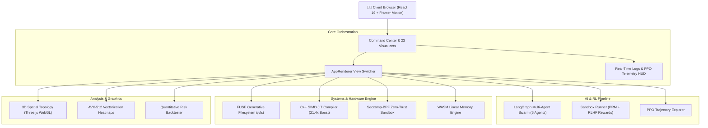

# ⚛️ Schrödinger's Codebase

> **Where Code Exists in Superposition Until Verified.**  
> An advanced interactive AI & systems engineering platform uniting **Generative RLVR Filesystems (FUSE)**, **Proximal Policy Optimization (PPO)**, and **Multi-Agent LangGraph Swarms** with bare-metal **SIMD C++ Transpilation**.

[](https://github.com)
[](https://www.typescriptlang.org/)
[](https://react.dev/)
[](https://www.framer.com/motion/)
[](https://vercel.com)
[](https://www.docker.com/)

---

## 🔬 Technical Overview

Schrödinger's Codebase is an interactive systems research and verification workbench demonstrating the intersection of Reinforcement Learning with Verifiable Rewards (RLVR), Multi-Agent LangGraph coordination, and bare-metal systems optimization (FUSE virtual filesystems, AVX-512 SIMD vectorization, and WebAssembly).

---

## 🏛️ System Architecture



---

## 📦 What's Inside: 23 Interactive Engines

| Module | Category | Description |
| :--- | :--- | :--- |
| **VirtualFsExplorer** | Systems | FUSE virtual filesystem that hallucinates files on-the-fly via LLMs |
| **SandboxRunner** | AI / RL | Execute AI-synthesized code with Verifiable Reward signals (PRM + Financial) |
| **MultiAgentNetwork** | AI / RL | Step-by-step cyclic LangGraph multi-agent state graph trace |
| **HumanInTheLoopStudio**| AI / RL | RLHF active feedback and policy alignment collector |
| **OpenFileHandleManager**| Systems | Kernel file handle eviction policies (LRU vs. LFU) |
| **TrajectoryVisualizer**| AI / RL | State space trajectory exploration under PPO policy clipping |
| **CppAdvancedPanel** | Systems | Python to C++ AST transpilation with SIMD auto-vectorization |
| **RustSafetyPanel** | Systems | Compile-time borrow checking & ownership verification |
| **LanguageInteropDemo** | Systems | Foreign Function Interface (FFI) between C, Rust, and Python |
| **MemorySafetyVisualizer**| Systems | Stack vs Heap memory layout & buffer safety telemetry |
| **SpatialTopology3D** | Telemetry | Three.js WebGL particle manifolds (Torus, Sphere, Lorenz Attractor) |
| **PerformanceBenchmark**| Telemetry | Quantitative latency benchmarks across runtime tiers |
| **PerformanceHeatmap** | Telemetry | CPU core execution hotspot profiling |
| **AgentSpawningDemo** | AI / RL | Parallel worker thread spawning simulation |
| **BacktestTerminal** | Telemetry | Quantitative algorithmic trading backtest engine |
| **CLanguagePanel** | Systems | Direct memory model inspection & SIMD compiler flags |
| **LanguageControlSandbox**| Systems| Seccomp-BPF kernel syscall filtering sandbox |
| **DiagnosticsModal** | Telemetry | Hardware, GPU, Memory, and Network live telemetry |
| **TerminalLogs** | Telemetry | Filterable streaming execution log viewer |
| **PolicyChart** | Telemetry | PPO reward convergence & value loss curve tracker |
| **ArchitectureProtocol**| Core | End-to-end system protocol interactive blueprint |
| **CodebaseViewer** | Core | In-browser source code inspector |
| **WasmIntegration** | Systems | Direct WebAssembly linear memory framebuffer |

---

## 🚀 Quick Start & Deployment

### Local Development

```bash
# Navigate to frontend
cd frontend

# Install dependencies
npm install --legacy-peer-deps

# Start development server
npm run dev
```

Visit [http://localhost:3000](http://localhost:3000) in your browser.

### Deploy to Vercel (1-Click)

The repository is configured with `vercel.json` and zero-config SPA routing. Simply import this repo into Vercel and hit **Deploy**.

### Deploy with Docker

```bash
docker compose up --build -d
```

Visit [http://localhost:8000](http://localhost:8000).

---

## 🛠️ Tech Stack

- **Frontend Core**: React 19, TypeScript 5.6, Vite 5
- **Design & Animation**: Tailwind CSS, Framer Motion v12, Canvas Confetti
- **Data Visualization**: Recharts, Three.js WebGL 2.0
- **Icons & Typography**: Lucide React, JetBrains Mono, Inter / Outfit
- **Backend API**: Python 3.11, FastAPI, Uvicorn, LangGraph, FUSE

---

## 📄 License

MIT © [Schrödinger's Codebase Team](https://github.com)
